# Lecture 2 事項
## 快速連結
以下連結需要瀏覽器登入 NCHU 學生帳號，才會正常運作。或是可在同個資料夾尋找同名檔案。
- [線上 Google Meeting 連結](https://lms2020.nchu.edu.tw/media/doc/86493)
- [Lecture 1 課堂講義.pdf](https://lms2020.nchu.edu.tw/filedownload/727223)
- [物聯網數據分析與應用-陳煥教授-教學大綱.pdf](https://lms2020.nchu.edu.tw/filedownload/727224)

點選下方 ```Open with Colab``` 即可直接開啟檔案至 Colab，留意 ```data.csv``` 不會被複製過去。

[Lecture 2 Linear_Regression]()

[](https://colab.research.google.com/github/awinlab/CourseTemplateTry/blob/main/Lecture%201%262/Lecture%202%20Linear_Regression.ipynb)
## Lecture 2 介紹與學習資源
> Lecture 2 介紹與學習資源.docx

**章節目標 : 在這一章節，我們將循序安裝各種環境，以建構一個 AIOT 的網頁系統與開發平台。**

本張學習與內容摘要：
1. 註冊拿 Google Map 開發 API 憑證
2. 在 Local XAMPP 裡面做出一個 Google Map(simple map)
3. 練習畫 Marker
4. 使用 GeoCoder 轉換經緯度並劃出 Google Map Marker

### 人工智慧是什麼

人工智慧:記憶, 推理, 理解, …. 感覺 生命= 生生感謝(生長、生殖、感應、代謝) 

弱人工智慧 weak AI ==只能做專一的事 

強人工智慧 Strong AI =我們努力的目標 思考  

westworld 西部世界   <- 是westworld的介紹，講述機器人出現自我覺醒，想擺脫樂園對機器人的控制。 

《西部世界》解構人類的本質，探索bicameral mind（二分心智理論），即人的大腦分為「說話指示」和「聆聽服從」的區域。神一般的人工智能Rehoboam，分析人類的行為，預測未來，並糾正社會錯誤，如同西部世界主人Ford那樣，為機械人（Host）編寫故事，控制他們的情緒行為；機械人Dolores啟發人類Caleb發現自己人生被控制，並反抗「神」，Ford亦引導Dolores覺醒，反抗人類。現實對照西部世界，證明自由意志的存在。 

第一二季，西部樂園揭示人的本質是惡，Ford設計讓機械人（Host）取代人類。第三季，Dolores違反創造者（Ford）的意志，發現人類的美好，而選擇解放世界。觀眾跟隨她理解人類本性，反抗現代控制人類的AI，拒絕任何「預定劇本」。 

機器人三大法則： 

科幻小說家艾西莫夫：在 1940年 代提出了 「機器人三大法則」，作為故事當中機器人的倫理守則。艾西莫夫定律是層次化的，即第一原則高於第二原則，第二原則高於第三原則。第一原則是機器人不得傷害人類，或看到人類受到傷害而袖手旁觀；第二原則是機器人必須服從人類的命令，除非這條命令與第一條相矛盾；第三原則是機器人必須保護自己，除非這種保護與以上兩條相矛盾。 

### 人工智慧歷史事件 
1962 年：


1997 年：

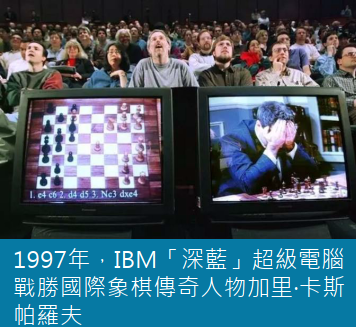

2016 年：

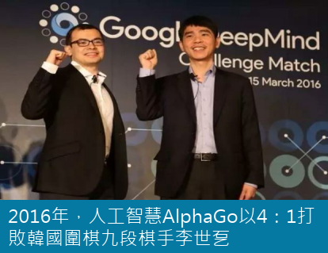

2017 年：

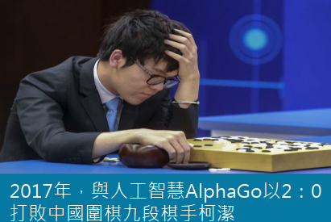


[Reference: 台灣經濟研究院/研究六所 范秉航 副研究員整理 (2017 投資人論壇) 一場抵十場 人工智慧場景大盤點](https://findit.org.tw/upload/research/news_20170622001.pdf)

### AI 從媒體, 科技展覽一直到政府部門受到重視

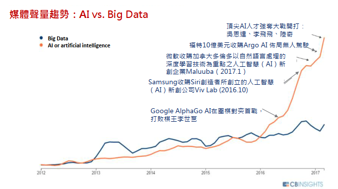

[Reference: 台灣經濟研究院/研究六所 范秉航 副研究員整理 (2017 投資人論壇) 一場抵十場 人工智慧場景大盤點](https://findit.org.tw/upload/research/news_20170622001.pdf)

#### AI 受到展覽會的焦點 


#### AI 受到政府部門重視

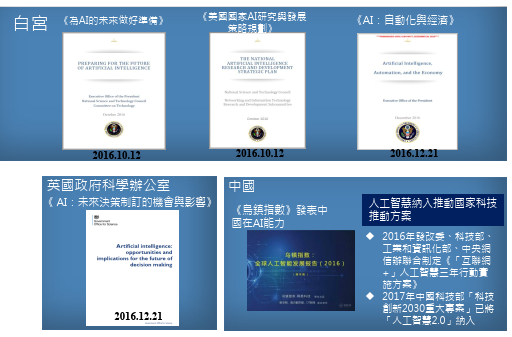\
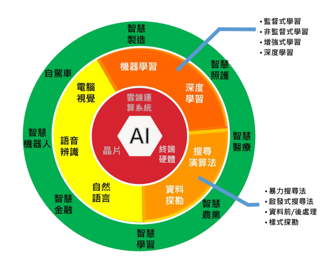


### 探討機器學習與深度學習之差異
人工智慧、機器學習以及深度學習已變成現今最熱門的話題之一，但以字面上的意思不足以清楚的表達其意義，使得人們常常混淆。以下這篇文章將帶領各位理解其定義，並且簡單的探討機器學習與深度學習基本概念與運算過程。 

#### 人工智慧(Artificial Intelligence)

所謂的人工智慧(Artificial Intelligence) 是人類建立於機器上的類似大腦智慧的一種判斷機制。其目的以編寫程式的方式，模擬出人類大腦中的決策，並模仿、理解、學習等等特性，而形成類似人類的「智慧」。其中利用大量的硬體設備作為資訊來源作為訊息的接收，舉例以鏡頭串流影像作為人眼、以麥克風收集聲音作為耳朵等等。 

人工智慧隸屬於大範疇，包含了機器學習(Machine Learning) 與深度學習(Deep Learning)。如下圖所示，我們最興趣的深度學習則是規範於機器學習之中的一項分支，而以下段落將簡單介紹機器學習與深度學習的差異。 


#### 機器學習(Machine Learning)
機器學習是一種透過演算法設計，讓機器去尋求最佳化的一種學科。能幫助人們探討一些複雜的問題，比如需要從一大堆數據資料判斷貓與狗時，從前人們必須利用過往的實驗經驗反覆地找出判斷規則或是最佳的判斷機制。而透過機器學習方式則提供許多有效率的演算法，幫助人們分析資料，比如說資料群聚分布，資料的回歸模型等等，將資料送至機器上進行演算找出最好的解答或是模型。以下將介紹機器學習的類別： 

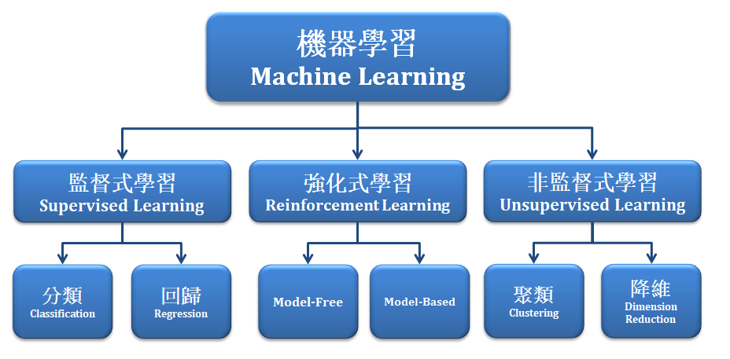

機器學習主要可分類成：

- 監督式學習：
須將每筆資料標記上一個「標籤」，比如是與非回答、狗與貓、蘋果與橘子，利用大量已知標籤資訊與資料訓練的方式建立出一個分類器(Classifier)或稱模型(Model)。除了資料分類，監督式學習亦包含回 歸分析(Regression)算法。最具代表的算法有 Adaboost 、SVM 、Neural Network 等等。 
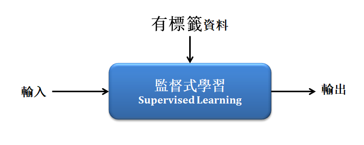
- 非監督式學習：
「無須標記標籤」於每筆資料，常以資料的分布狀況去建立一個分類器。除了聚類分類(clustering)，非監督式學習亦包含降低維度(dimensionality reduce)以及關聯規則( association rule)等演算法。 最具代表的算法有 Kmean 、PCA 等等。 
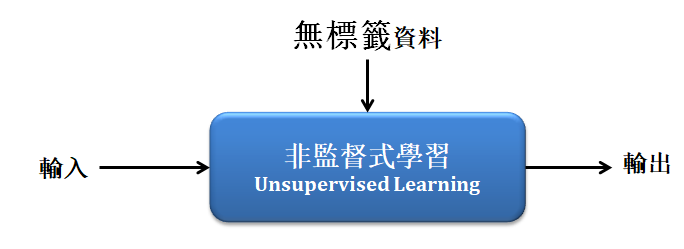
- 強化式學習：
則是「不需給機器任何資料」，讓機器不斷從互動中學習，並利用獎懲與成效評估的機制，不斷嘗試與修正至最佳化的模型。最具代表的算法有 Q-Learning 、SARSA 等等。
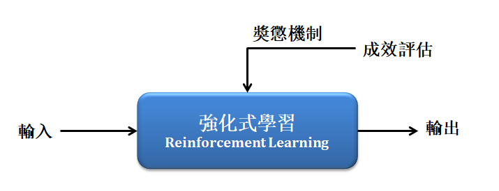

近年來深度學習的基礎皆來至於類神經網路的演算法，以下先簡單介紹此算法。

### 類神經網路(Neural Network):

近年回歸於熱門的就是類神經網路(Neural Network)，起源1943年於 沃倫·麥卡洛克 和 沃爾特·皮茨 為一種閾值邏輯的演算法。因為利用數個節點進行判斷，很像人類的神經元故以神經網路而命名。然而此算法運算量頗大，當時又缺乏硬體設備，造成神經網路的發展受到侷限，且當時支撐向量機(SVM)正受到學界關注，故類神經網路不受青睞。 

時間線回到現今，因有充足的硬體設備使得神經網路重新受到矚目，竟而發展出 RNN 遞迴神經網路、 LSTM 長短時記憶網路、 RBF 神經網路等等算法，我們所認知的卷積神經網路(CNN)也是從中發展而來，其中類神經網路最具代表性的設計為反向傳遞的機制 ，經由不斷迭代，對比預測值與實際值之間的誤差，以修正模組中的權重，竟而達到最佳化之目的，以下將簡單介紹類神經網路(NN)的算法。 

探討架構之前須理解感知器(Perceptron)，而所謂的感知器可想像為人類大腦中的每一個神經元，我們透過這些神經網的傳遞與訊號，給我們做出正確的判斷。如下圖所示，我們可將資料作為 x1 至 xd 並代入權重相加計算，得到一個評分數值 y，藉由這個數值去判斷是與否、狗與貓等等二元分類的答案。 

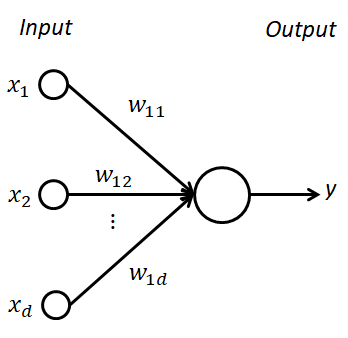

回到類神經網路可以說是一種多層的感知器模型，可以想像成數個神經元(感知器)所構成的複雜網路。最基礎神經網路架構可分作輸入層、隱藏層、輸出層，如下圖所示: 

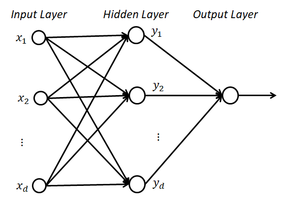

而透過大量的資料訓練以及反向傳播的機制，不斷誤差修正各個感知器的權重，因此可以清楚地反映資料分布，竟可能找出最佳化真實模型。訓練資料的方式常以是數張圖片，以同樣規格尺寸與特徵進行訓練與分類。雖然神經網路可以很好的反應出最佳化模型，但直接代入圖片至類神經網路進行訓練並不能獲得一個很好的模型，其狀況是因為構成良好的模組之前須帶入有效的特徵數據或是良好的特徵擷取，才能獲得較佳的模型。 

### 深度學習(Deep Learning)

對於有效的特徵數據一直都是機器學習中一個較深論的課題，近年來深度學習出現簡化這項問題， 直接打破上述這些思維。所謂的深度學習與機器學習最大的差異，就是輸入端的特徵提取!! 而深度學習將會透過卷積的方式，取代了特徵提取這個環節，如下圖說明機器學習與深度學習的主要差異。 

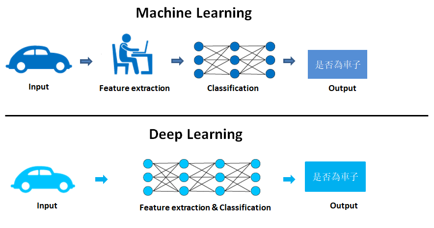

卷積神經網路(Convolutional Neural Network, CNN )，為具代表性的深度學習算法之一，是由類神經網路演化而來。 如下圖所示，此算法透過卷積(Convolution)的方式，對圖片進行特徵提取(feature extraction)，其中卷積的遮罩係數則是隨機產生的。透過卷積濾波器產生的特徵，送至分類器(Classification)進行分類即為卷積神經網路。 


(此圖出處於參考文獻) 

卷積神經網路(CNN)主要可分為： 
1.	卷積層（convolution layer）：利用隨機產生的遮罩進行特徵提取。 
2.	池化層（pooling layer)：對不同位置的特徵進行統計，並取平均值或最大值作為最佳參考點，以減少資料特徵維度。 
3.	全連接層（fully connected layer）：是將之前的卷積與池化後之結果進行平坦化，並接到最基本的神經網絡。 

透過上述所介紹的主要的三個層，即可完成一個CNN架構，如下圖所示為最典型的CNN架構。 

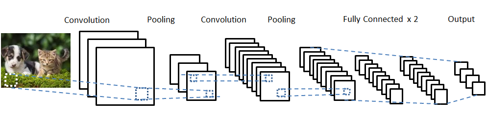

透過深度學習的方式，簡單的將提取到有效的特徵。盡而逼近最佳模型。因此近年來有許多學術專家對 CNN 架構進行研究並舉辦比賽，目前較熱門的 CNN 模型有 LeNet、VGG、ResNet 等等，並經由研究得知只要架構的深度夠深，對於模型的準確度越高，故而稱為深度學習。

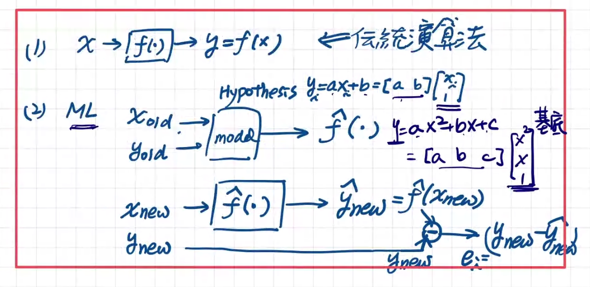

[凸函數定義](https://zh.wikipedia.org/wiki/%E5%87%B8%E5%87%BD%E6%95%B0)

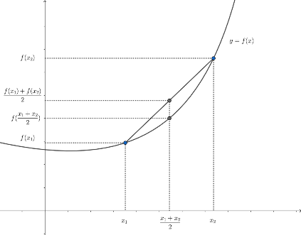
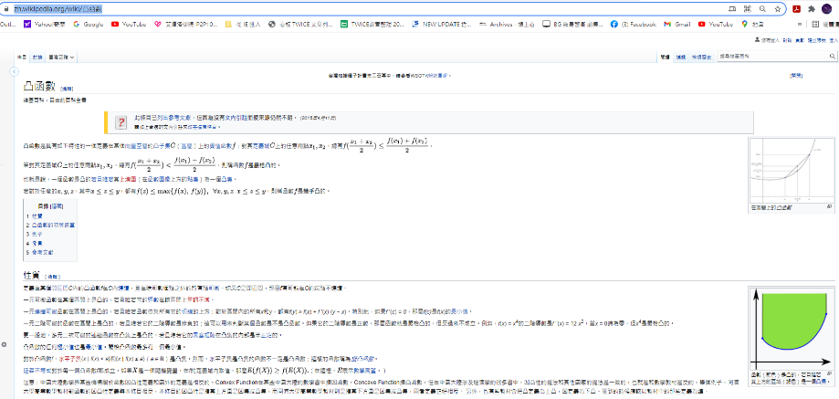
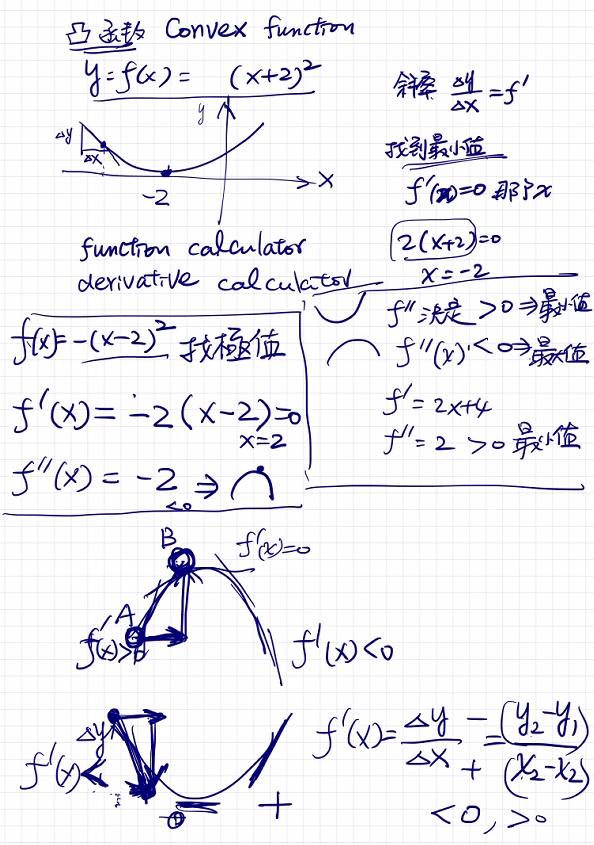
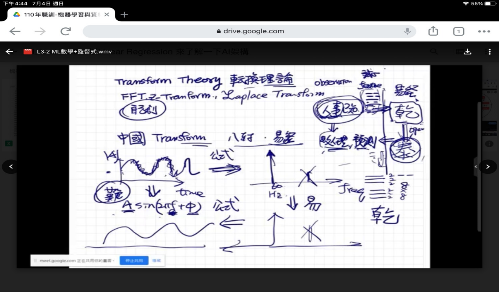
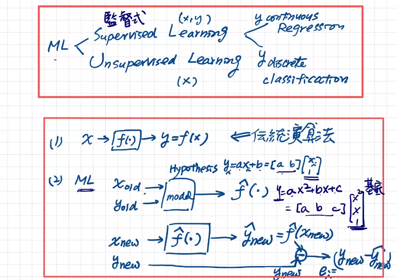
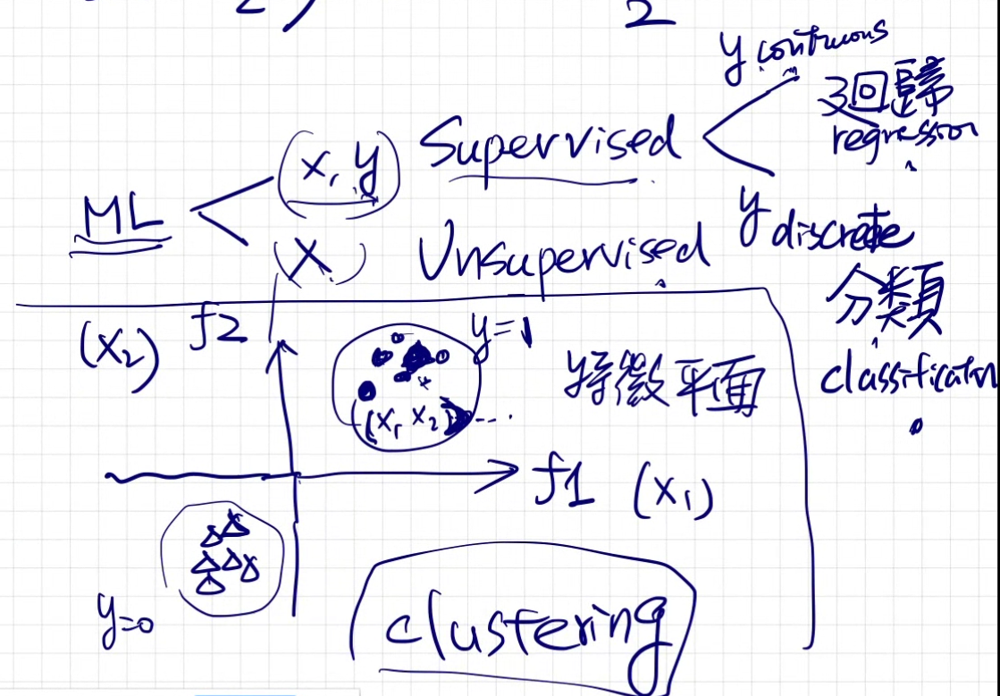
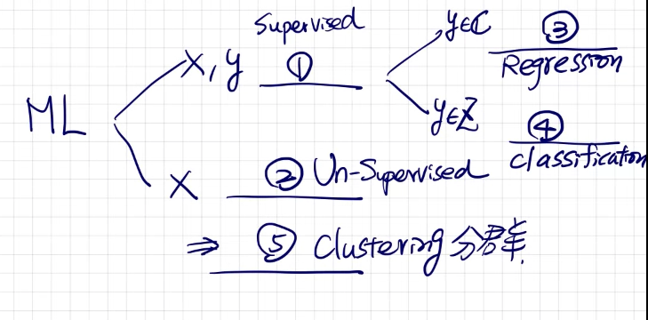
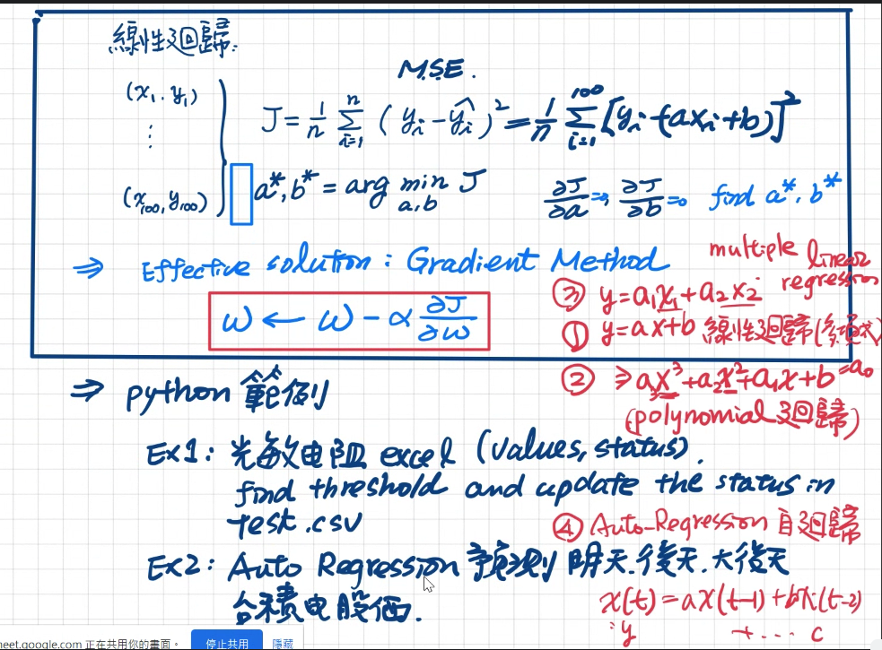

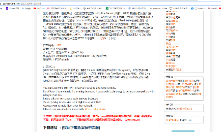

## 開發工具
- Colab
- Ancoda Python
- Visual General IDE
