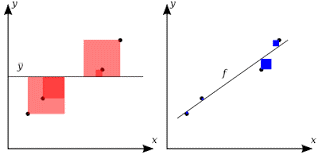
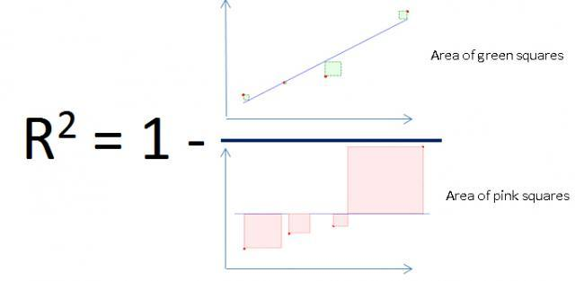
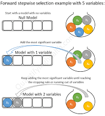
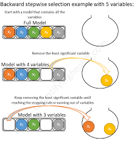

# Lecture 4
## 快速連結
以下連結需要瀏覽器登入 NCHU 學生帳號，才會正常運作。或是可在同個資料夾尋找同名檔案。
- [線上 Google Meeting 連結](https://lms2020.nchu.edu.tw/media/doc/86493)

點選下方 ```Open with Colab``` 即可直接開啟檔案至 Colab，留意 ```data.csv``` 不會被複製過去。

[Lecture 4 Logistic_Regression]()

[](https://github.com/awinlab/CourseTemplateTry/blob/main/Lecture%204%20Logistic%20regression/Multi-Linear%20regression%202021.10.2(Answer%20sample%20NotUseSelection)%20.ipynb)
## Review 上次內容
* 線性回歸,我們介紹什麼是Excel操作並用幾個例子說明線性回歸的應用, 感測器較正
* 在用Python 來實現=>google  Coble
* ML 實作方法熟悉一下follow CRISP-DM (跨領域資料分析作業流程) 方法論來建立ML 模型
    * step1:獲取資料
        * Kaggle 2000+ opendata CSV
        * 爬蟲 FindMind XML,GET/POST,定時爬蟲
        * API (永豐,Google,天氣) REST
    * step2:清理Data
        * UNet
        * LabelImg
        * LabelMe
    * step3:select model
    * step4:evaluate model<br>
        
        
    * step5:deploy model
## 多元線性回歸
### 問題特色
1. Linearity (因變數xi 跟y之間有線性關係)
2. Homoscendasticity (每一個xi 方差都一樣)
3. Mulivariate normality (每一個xi normal distribution)
4. Independence of error (誤差獨立)
5. Lack of multicollinearity (不可有共線性)

### 實作上沒辦法一一檢驗, 所以用下面這種工程方法來挑選適合的特徵組
1. All-in (何時可用🡺 你是專家, 滿足上面五個要求, Con: 當特徵很多時 100個以上, 你就算是專家, 你也很難完全保證)
2. Stepwise Selection (greedy method)
    1. Backward selection (最常用)<br>
        篩選標準 p-value (p-value < 0.05 顯著, <0.01非常顯著) 出錯的機率<br>
        
    2. Forward selection<br>
        
    3. Bidirection selection
3. Score selection (feature selection optimization)

假設有 10 特徵可選, 共有2^10=1024 特徵集的選擇<br>
暴力破解可找到最佳 (sklearn Grid Serarch)<br>
可是壞處就是沒時間因此要訴諸所謂的搜尋演算法<br>
進階的搜尋演算法使用Meta-heuristic<br>
參考 聯合大學陳士杰
[課程](http://debussy.im.nuu.edu.tw/sjchen/ML_final.html)<br>
主要有名: Hill climbing algorithm, GA, PSO, SA, TS…

## DATA 型態
Nominal data 需要做OneHotEncoding (1 to n ) 產生數個DUMMY VARIABLE (特徵)<br>
這時又產生另一個問題 Dummy variable trap 陷阱(如果n個都用的話一定最後一個是線性相依 xn=1-x1-x2-…-xn-1)<br>
Solution🡺新產生n 個只能放n-1進去式子裡面

Label Encoding 動作 (1 to 1)== Label

看p-value  [sample code](https://stackoverflow.com/questions/27928275/find-p-value-significance-in-scikit-learn-linearregression)
